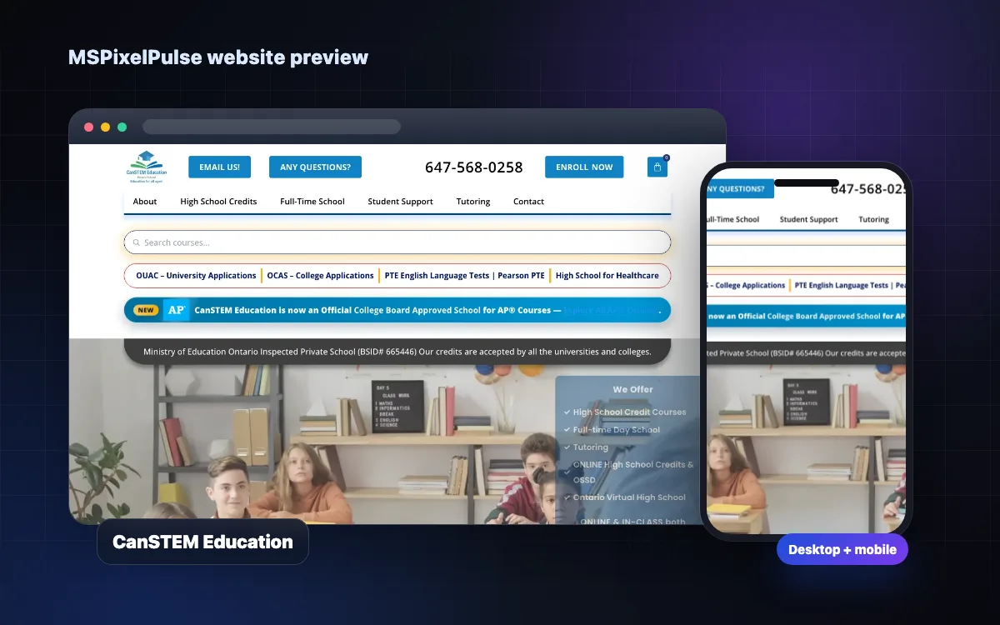
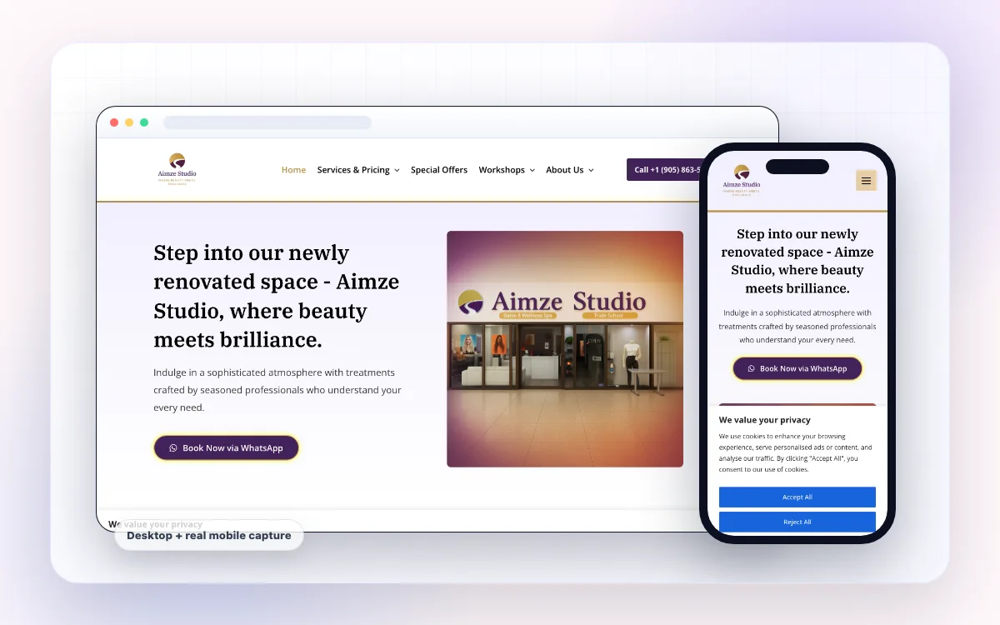

# WordPress Project Case Studies

## Overview

This document contains portfolio-ready case studies for the WordPress projects currently verified in the MSPixelPulse portfolio:

1. [CanSTEM Education Private School](#case-study-1-canstem-education-private-school)
2. [Aimze Studio Salon & Spa](#case-study-2-aimze-studio-salon--spa)

These projects show two different sides of WordPress development. CanSTEM is a large, content-heavy education website with course information, forms, student resources, payment workflows, and ongoing technical support. Aimze Studio is a visually led local-business website built around services, offers, trust, and appointment intent.

The case studies focus on verified scope and visible functionality. No unverified traffic, ranking, revenue, conversion, or performance claims are included.

---

# Case Study 1: CanSTEM Education Private School

## Project Snapshot

| Field | Details |
| --- | --- |
| Project | CanSTEM Education Private School |
| Industry | Private education and student services |
| Location context | Greater Toronto Area, Ontario |
| Website type | Content-rich education and course website |
| Platform | WordPress |
| Supporting technologies | HTML, CSS, JavaScript, PHP, WordPress REST endpoints, Google Apps Script |
| Primary audiences | High-school students, adult learners, international students, parents, and tutoring clients |
| Project status | Live website work with ongoing maintenance and content development |
| Live website | [canstemeducation.com](https://canstemeducation.com/) |
| Code repository | Private working repository; available for review when appropriate |

## Portfolio Summary

CanSTEM Education required more than a standard brochure website. Its WordPress presence needed to organize a broad collection of programs, credit courses, enrollment routes, student-support resources, policies, forms, payment tools, and frequently updated information.

The work focused on turning that operational complexity into reusable website components and clear user paths. Custom page sections, course layouts, form workflows, navigation aids, calls to action, and technical snippets were developed for use inside WordPress. A structured code library was also maintained so that development and production versions could be tracked outside the WordPress editor.

## The Challenge

An education website serves several user groups at once. A prospective student may be comparing courses, a parent may be checking program credibility, an existing student may need a policy or final-exam form, and an international applicant may be looking for an entirely different enrollment route.

The main challenges were:

- Presenting a large amount of academic and administrative content without losing clear navigation.
- Supporting different pathways for high-school credits, full-time school, adult education, online study, tutoring, language preparation, and student services.
- Making program and course information easier to scan on both desktop and mobile devices.
- Creating reusable layouts for many course pages instead of rebuilding every page from the beginning.
- Connecting frontend forms with WordPress/PHP handlers and Google-based workflows.
- Preserving separate development and production versions of frequently updated components.
- Supporting technical SEO, indexing, redirects, schema-related adjustments, and performance configuration.
- Keeping calls to action visible across long, information-heavy pages.

## Project Goals

The website work was guided by five practical goals:

1. **Make program discovery easier.** Visitors should be able to move from a general program category to the relevant course, registration, or inquiry path.
2. **Reduce friction around enrollment.** Forms and calls to action should support prospective students at the moment they are ready to ask a question or register.
3. **Create a maintainable content system.** Reusable components and templates should make future course and page updates more consistent.
4. **Support current students as well as new leads.** Policies, live links, exam information, payment tools, and other resources must remain accessible.
5. **Protect production stability.** Development, testing, and live versions should be clearly separated for higher-risk forms and integrations.

## Strategy and Approach

### 1. Information Architecture

The content was grouped around the tasks visitors were trying to complete rather than treated as one flat collection of pages. Major paths included:

- High-school credit courses
- Advanced Placement courses
- Full-time school
- Adult education and OSSD pathways
- International student information
- Online high school
- Tutoring and test preparation
- Student support
- Registration and inquiry
- Payment and administrative requests

This structure allowed the website to support both marketing and day-to-day school operations.

### 2. Reusable WordPress Components

Custom HTML, CSS, JavaScript, and PHP snippets were organized into a reusable working library. Components included:

- Responsive content sections
- Program and course cards
- Course tables and unit layouts
- Accordions and FAQ sections
- Fee and pricing blocks
- Search and filtering interfaces
- Breadcrumb navigation
- Notice and announcement blocks
- Calls to action
- Header, footer, and sub-footer elements
- Custom 404 page versions

Reusable components reduced duplicated work and helped related pages maintain a consistent visual and interaction pattern.

### 3. Course Content System

The project included structured layouts for high-school and AP course information. Template files separated common layout behaviour from course-specific content, making it easier to present:

- Course codes and titles
- Grade and pathway information
- Course descriptions
- Units and learning sections
- Fee information
- Registration calls to action

This approach supported a growing course catalogue without requiring each course page to be designed independently.

### 4. Form and Workflow Development

The website included multiple form types for prospective and current students. Work covered frontend markup, browser-side validation and interactions, WordPress/PHP processing, and Google Apps Script integrations where required.

Form-related areas included:

- General inquiry
- High-school enrollment
- Full-time school enrollment
- Tutoring inquiries
- Course change requests
- Final-exam requests
- Administrative and student-service workflows

Development and production versions were maintained separately for workflows that depended on live endpoints, email delivery, Google Sheets, Google Drive, document generation, or WordPress REST/AJAX handlers.

### 5. Conversion and User Guidance

Long education pages can become difficult to act on, even when the information is useful. Clear next steps were incorporated throughout the experience:

- Enroll-now actions
- Registration links
- Inquiry forms
- Program-specific calls to action
- Course discovery links
- Payment access
- Student-support shortcuts
- Breadcrumbs and table-of-contents patterns

The goal was to help a visitor move from research to the correct action without having to restart from the homepage.

### 6. SEO and Technical Support

The project’s working library also supported ongoing technical website needs, including:

- Search-friendly page structure
- Heading and content hierarchy
- Breadcrumb components
- Yoast-related settings and snippets
- Schema and protected-page indexing adjustments
- Robots.txt versions
- HTTPS and URL handling
- Redirect and `.htaccess` references
- Google Search Console-related code
- Social/advertising pixel implementation
- WP Rocket performance configuration notes

SEO work was treated as part of the website’s structure and maintenance rather than as a one-time text update.

## Key Features Delivered

- Multi-level program and student-service navigation
- High-school and AP course presentation templates
- Course tables, unit sections, and reusable content blocks
- Enrollment, inquiry, tutoring, course-change, and exam-request forms
- WordPress/PHP backend processing snippets
- Google Apps Script workflows for submissions and related administration
- Secure-payment page components and backend integration support
- Fee tables, pricing sections, and searchable information layouts
- Program-specific FAQ and accordion sections
- Breadcrumbs and long-page navigation aids
- Development and production variants for controlled publishing
- Technical SEO and Search Console support
- LMS and Moodle-related documentation and content support
- Responsive layouts for desktop, tablet, and mobile use

## User Experience Decisions

### Scannable Academic Content

Dense program information was separated into tables, accordions, cards, headings, and short action sections. This made pages more useful to visitors who needed a specific answer without forcing them to read every paragraph.

### Clear Audience Pathways

Different users were directed toward the information relevant to them: course shoppers toward course pages, existing students toward support resources, and prospective learners toward registration or inquiry.

### Repeated but Contextual Calls to Action

Calls to action were placed near relevant content rather than reserved for a single section at the bottom of the page. A visitor reviewing fees or course requirements could act without navigating elsewhere first.

### Mobile-Friendly Interaction

Tables, content blocks, forms, accordions, buttons, and navigation elements were designed or adjusted with smaller screens in mind. This was especially important for students accessing information or completing a request from a phone.

## Development and Maintenance Workflow

The project used a practical snippet-based workflow tailored to a live WordPress environment:

1. Build or revise the component in a development file.
2. Test the standalone layout and interaction where possible.
3. Validate any WordPress, PHP, REST, Apps Script, email, or payment dependency in the appropriate environment.
4. Publish the approved component to the correct WordPress page, shortcode, widget, theme, or plugin location.
5. Save the current production version in the repository.
6. Retain older versions when they may be needed for comparison or rollback.

This workflow created a clearer source of truth for custom work that would otherwise exist only inside a page builder or WordPress code field.

## Outcome

The completed work supports a live education website with a wide range of public and operational content. Visitors can explore programs, review courses, access student services, start enrollment, submit requests, and reach external learning or application systems through task-focused paths.

The most important project outcome was maintainability: recurring layouts, forms, and technical snippets were organized into a reusable code library, allowing the WordPress website to keep evolving without treating every update as an isolated one-off change.

No numeric business result is claimed here. Traffic, ranking, enrollment, and conversion data should only be added when verified analytics or client-approved figures are available.

## My Contribution

- WordPress page development and support
- Custom HTML, CSS, and JavaScript components
- PHP and WordPress integration snippets
- Responsive layout implementation
- Course and program content structure
- Form UI and workflow development
- Google Apps Script integration support
- Payment-page component support
- Reusable template and component organization
- Technical SEO and indexing support
- Website maintenance and production updates
- LMS-related content and technical documentation

## Technology and Tools

`WordPress` · `HTML5` · `CSS3` · `JavaScript` · `PHP` · `WordPress REST API` · `Google Apps Script` · `Google Sheets` · `Google Drive` · `Yoast SEO` · `Google Search Console` · `WP Rocket` · `Moodle/LMS`

## Short Portfolio Version

**CanSTEM Education Private School**  
A large WordPress education website supporting course discovery, admissions, student services, forms, payment workflows, and ongoing content updates. I developed reusable page components, course layouts, form interfaces, PHP and Apps Script integrations, navigation aids, and technical SEO support for a complex live website.

**Services:** WordPress development, responsive design, reusable components, form workflows, technical SEO, maintenance  
**Live site:** [canstemeducation.com](https://canstemeducation.com/)

## Suggested Portfolio Tags

`WordPress` `Education` `Responsive Design` `Custom Components` `Forms` `PHP` `Google Apps Script` `SEO` `Website Maintenance`

---

# Case Study 2: Aimze Studio Salon & Spa

## Project Snapshot

| Field | Details |
| --- | --- |
| Project | Aimze Studio Salon & Spa |
| Industry | Beauty, salon, spa, and wellness |
| Location context | Brampton, Ontario |
| Website type | Local service and appointment-focused business website |
| Platform | WordPress |
| Supporting technologies | HTML, CSS, PHP, WordPress page components |
| Primary audiences | Local beauty, hair, skincare, wellness, and workshop clients |
| Project status | Live website |
| Live website | [aimzestudio.com](https://www.aimzestudio.com/) |
| Code repository | [github.com/Oyemahak/AimzeStudio](https://github.com/Oyemahak/AimzeStudio) |

## Portfolio Summary

Aimze Studio needed a polished WordPress website that could introduce a newly renovated salon and spa, present a broad service menu, build local trust, promote timely offers, and turn interest into appointment inquiries.

The website was structured around the way local service customers make decisions. Visitors can quickly understand the studio’s positioning, browse beauty and wellness categories, review service and pricing information, see examples of the studio’s work, read client stories, discover workshops, and move directly to a booking conversation.

Custom WordPress-ready page elements were developed for the homepage, services and pricing, special offers, workshops, Reiki, yoga, partner content, blog content, and supporting conversion sections.

## The Challenge

Aimze Studio serves customers across several related but distinct categories, including hair, aesthetics, laser services, massage, wellness, workshops, and training. The website needed to feel cohesive without flattening those services into one generic list.

The main challenges were:

- Giving the new studio a premium, credible online presence.
- Organizing a wide range of services and pricing in a way that remained easy to scan.
- Balancing salon, aesthetics, wellness, rehabilitation, and workshop content within one brand.
- Making appointment actions visible without overwhelming the visual design.
- Supporting promotions and special offers that could change over time.
- Creating enough trust for a local customer to take the next step.
- Keeping the experience usable across desktop and mobile devices.
- Building modular WordPress content that could be revised as the service menu evolved.

## Project Goals

1. **Establish the brand online.** Present Aimze Studio as a polished, welcoming, and professional local destination.
2. **Make services easy to understand.** Help visitors move from a broad category to relevant pricing or appointment information.
3. **Generate appointment intent.** Use direct, visible booking actions and strong service-focused calls to action.
4. **Build trust.** Support the brand with portfolio imagery, client stories, business information, and service detail.
5. **Support future updates.** Create reusable WordPress elements for services, offers, workshops, and editorial content.

## Strategy and Approach

### 1. Service-Led Information Architecture

The website navigation and page structure were designed around high-intent visitor questions:

- What services are available?
- What does a treatment include?
- How much does it cost?
- What offers are currently available?
- Can I see examples of the studio’s work?
- How do I book?

Primary content areas included:

- Services and pricing
- Aesthetic services
- Haircut, styling, and colour
- Laser and hair-removal services
- Massage and related wellness services
- Chiropractic and physiotherapy
- Reiki
- Yoga and meditation
- Workshops and training
- Special offers
- About, partners, reviews, blog, and contact content

### 2. Strong First Impression

The homepage leads with a clear brand statement, supporting copy, and a direct booking action. This was followed by timely offer content and a visual service overview, allowing new visitors to understand both the studio’s personality and its practical value early in the page.

The design direction emphasized:

- Large, confident headline content
- Beauty and wellness imagery
- Clear content hierarchy
- Spacious sections
- Service-category entry points
- Promotional highlights
- Repeated appointment actions

### 3. Service and Pricing Presentation

For a multi-service studio, pricing information can become difficult to scan. Custom service and pricing components were developed to keep related treatments grouped and make individual options easier to compare.

The page library included:

- General services and pricing layouts
- Section-level service navigation
- Individual treatment information
- NuFree hair-removal content
- Reiki service pages
- Special-offer blocks
- Workshop and training layouts

These modular elements made it easier to update one area without redesigning the entire website.

### 4. Booking-Focused Conversion Flow

The primary conversion goal was appointment intent. Booking actions were placed at the moments where visitors were most likely to be ready:

- In the hero section
- Near service information
- Following promotional content
- After trust and portfolio sections
- Near contact and location details

WhatsApp booking provided a direct path from browsing to a conversation, which suits a local salon workflow where customers may want to ask about availability or treatment fit before confirming.

### 5. Trust and Visual Proof

Beauty and wellness decisions are highly visual and trust-sensitive. The site used several content types to reduce uncertainty:

- A gallery of completed work
- Client-story and testimonial content
- A studio introduction
- Clear service categories
- Partner content
- Contact and location information
- Business hours
- Blog and educational content

This gave visitors more than a service list; it showed the atmosphere, range, and customer experience surrounding the services.

### 6. Ongoing Content and Promotion

The WordPress structure supported content that could continue changing after launch:

- Special offers
- Service pricing
- Blog articles
- Workshop announcements
- Partner information
- Yoga and Reiki content
- Seasonal or opening promotions

This was important for a business whose services, promotions, and events may evolve more often than the core brand pages.

## Key Features Delivered

- Responsive WordPress business website
- Booking-focused homepage
- Mobile-friendly main navigation
- Multi-category service presentation
- Detailed services and pricing content
- WhatsApp appointment calls to action
- Special-offer and promotion sections
- Beauty-work gallery
- Client-story and testimonial sections
- About and brand-story content
- Workshop and training pages
- Yoga, meditation, and Reiki content
- Partner showcase content
- Blog page components and individual article layouts
- Business hours, contact, and location sections
- Custom 404 page work
- Reusable production and development snippets

## User Experience Decisions

### Bookings Stay Close to Service Content

The website does not make visitors search for the next step. Booking actions appear near the hero, offers, service content, and closing contact area.

### Service Categories Reduce Cognitive Load

Instead of presenting every treatment in one continuous list, the website introduces major categories first. Visitors can choose the area that matches their needs before reviewing details.

### Visual Work Supports the Decision

The gallery is positioned as decision-making content, not decoration. It helps prospective customers understand the studio’s range and style before booking.

### Promotions Are Easy to Find

Special offers receive a visible place in the main navigation and homepage flow. This supports campaign updates without distracting from the evergreen service structure.

### Mobile Contact Is Direct

Call and WhatsApp actions support the behaviour of local customers who are already browsing on a phone and want to move directly into an appointment conversation.

## Content and SEO Structure

The site supports local discovery and service relevance through:

- One clear primary heading per page
- Descriptive service headings
- Dedicated pages or sections for important services
- Local business context
- Human-readable navigation labels
- Internal links between services, offers, workshops, and contact paths
- Descriptive image alternative text where content is published
- Blog content that can answer service-related questions
- Consistent business and contact information

No ranking result is claimed without access to verified Search Console or analytics data.

## Responsive and Accessibility Considerations

- Navigation adapts for smaller screens.
- Calls to action remain large enough to identify and use on touch devices.
- Service content is broken into readable sections rather than compressed tables where possible.
- Headings create a logical reading hierarchy.
- Links use descriptive service or action labels.
- Images support text content instead of replacing essential information.
- Contact and booking methods are available as recognizable actions.
- Page components are designed to remain readable across common screen sizes.

## Development Workflow

Custom WordPress page elements were developed and stored in a supporting repository. The project files include development and production variants for several sections, allowing changes to be tested before being moved into the live website.

The repository covers:

- Homepage and offer components
- Service and pricing layouts
- Workshop versions
- Reiki and yoga pages
- Blog content and supporting styles
- Partner sections
- Custom PHP snippets
- 404 page variants

This approach makes custom WordPress work easier to maintain than relying only on code stored inside the live editor.

## Outcome

Aimze Studio launched with a complete local-business website that combines brand presentation, service discovery, visual proof, promotional content, and direct appointment actions.

The website gives the studio a flexible base for adding services, revising prices, publishing offers, promoting workshops, and sharing editorial content. Its primary user journey is clear: understand the brand, find a relevant service, build confidence through visual and client content, and start a booking conversation.

The website is live and publicly reviewable. No traffic, lead, revenue, or ranking figure is included because those results require verified business analytics.

## My Contribution

- WordPress website design and development
- Homepage and section layout
- Service information architecture
- Custom HTML and CSS page elements
- WordPress/PHP snippet support
- Responsive design and mobile polish
- Services and pricing presentation
- Booking call-to-action strategy
- Special-offer layouts
- Gallery and client-story sections
- Workshop, blog, partner, yoga, and Reiki page content
- Reusable development and production code organization
- Ongoing WordPress content support

## Technology and Tools

`WordPress` · `HTML5` · `CSS3` · `PHP` · `Responsive Design` · `Local SEO Structure` · `WhatsApp Booking`

## Short Portfolio Version

**Aimze Studio Salon & Spa**  
A polished WordPress website for a Brampton beauty and wellness studio. I designed and developed a service-led experience with pricing content, special offers, portfolio imagery, client stories, workshops, and direct WhatsApp booking calls to action. The responsive structure helps local customers move from discovery to appointment intent with minimal friction.

**Services:** WordPress design and development, service architecture, responsive design, booking UX, content structure  
**Live site:** [aimzestudio.com](https://www.aimzestudio.com/)  
**Repository:** [github.com/Oyemahak/AimzeStudio](https://github.com/Oyemahak/AimzeStudio)

## Suggested Portfolio Tags

`WordPress` `Beauty and Wellness` `Local Business` `Responsive Design` `Booking UX` `Service Pages` `Portfolio Gallery` `Content Strategy`

---

# Combined WordPress Portfolio Introduction

## Long Version

My WordPress work combines visual design, content architecture, custom frontend development, and practical business workflows. I build websites that do more than publish information: they help visitors find the right service, understand the offer, trust the business, and take a clear next step.

Across education and local service projects, I have developed responsive page sections, reusable templates, course and pricing layouts, booking paths, complex forms, PHP integrations, Google Apps Script workflows, technical SEO components, and maintainable development-to-production processes.

I adapt the structure to the business. A content-heavy school website needs strong information architecture, reusable course systems, student resources, and reliable forms. A salon and wellness website needs visual confidence, service clarity, local trust, promotions, and fast appointment actions. The platform may be the same, but the user experience and implementation should reflect the actual business.

## Short Version

I design and develop custom WordPress websites for organizations that need clear content, responsive layouts, strong calls to action, and maintainable day-to-day publishing. My work includes custom page components, service and course structures, booking and inquiry flows, forms, PHP integrations, technical SEO support, and ongoing website maintenance.

## One-Line Version

Custom WordPress design and development focused on clear user journeys, responsive performance, reusable content systems, and business-ready conversion paths.

---

# Portfolio Card Copy

## CanSTEM Education

**Title:** CanSTEM Education Private School  
**Category:** WordPress · Education  
**Card summary:** A content-rich education website with reusable course layouts, enrollment paths, student resources, custom forms, and ongoing technical support.  
**CTA label:** View Case Study  
**Live-site label:** Visit Live Website

## Aimze Studio

**Title:** Aimze Studio Salon & Spa  
**Category:** WordPress · Beauty & Wellness  
**Card summary:** A service-led local business website with pricing content, promotional sections, visual proof, and direct appointment calls to action.  
**CTA label:** View Case Study  
**Live-site label:** Visit Live Website

---

# Recommended Case Study Page Metadata

## CanSTEM Education

**SEO title:** CanSTEM Education WordPress Case Study | MSPixelPulse  
**Meta description:** Explore the CanSTEM Education WordPress project, including reusable course layouts, enrollment forms, student resources, PHP integrations, technical SEO, and responsive website support.  
**Suggested slug:** `/projects/canstem-education-wordpress-case-study`

## Aimze Studio

**SEO title:** Aimze Studio WordPress Case Study | MSPixelPulse  
**Meta description:** See how MSPixelPulse created a responsive WordPress website for Aimze Studio with service pages, pricing content, promotions, portfolio imagery, and booking-focused calls to action.  
**Suggested slug:** `/projects/aimze-studio-wordpress-case-study`

---

# Publishing Notes

- Keep the CanSTEM source repository private unless its owner explicitly approves public access.
- Use the existing mockup images from `public/projects/mockups/` as the case-study cover images.
- Do not publish private form endpoints, API credentials, email-processing logic, payment secrets, student data, or LMS records.
- Do not add conversion, traffic, ranking, revenue, enrollment, or speed claims without verified evidence.
- If client approval is required, confirm the wording of responsibilities before publishing first-person claims.
- Recheck live links, current services, and public business information before each major portfolio update.
- Keep the project classifications clear: both projects are live website work, not fictional demo concepts.
- Add analytics-backed outcomes later as a separate “Measured Results” section only when the data is available and approved.

